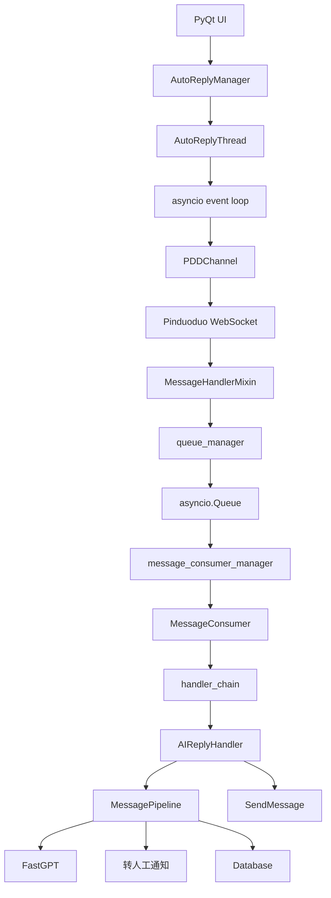

# ARCHITECTURE.md

## 当前架构

当前核心业务运行在 Windows/PyQt 进程内。

主要链路：

```text
PyQt UI
  -> AutoReplyManager
    -> AutoReplyThread
      -> asyncio event loop
        -> PDDChannel
          -> Pinduoduo WebSocket
          -> MessageHandlerMixin
          -> queue_manager
          -> message_consumer_manager
          -> MessageConsumer
          -> handler_chain
          -> AIReplyHandler
          -> MessagePipeline
          -> FastGPT
          -> SendMessage
```

## 当前架构问题

当前主要问题不是业务逻辑，而是运行时生命周期和并发边界。

重点风险：

1. 每账号一个 QThread。
2. 每线程一个 asyncio event loop。
3. `queue_manager` 是模块级单例。
4. `message_consumer_manager` 是模块级单例。
5. `asyncio.Queue` 有 event loop 归属问题。
6. 重连可能导致 consumer 重复创建。
7. 旧 task 未退出，新 task 已启动。
8. 消息消费存在 task 增长风险。
9. 停止线程时可能没有完整 await cleanup。

## 当前稳定性改造目标

P0 阶段目标：

1. `_setup_message_consumer()` 幂等。
2. MessageConsumer 固定 worker pool。
3. reconnect lifecycle lock。
4. reconnect generation。
5. graceful shutdown。
6. 诊断日志。
7. 不修改业务回复逻辑。
8. 不修改 `queue_name`。

## Linux 私有化部署目标架构

目标是逐步迁移为 Linux 可交付服务。

目标架构：

```text
Linux Server
  ├── API Service
  │   ├── health check
  │   ├── status query
  │   ├── config management
  │   └── account start/stop
  │
  ├── WebSocket Worker
  │   ├── PDD long connection
  │   ├── heartbeat
  │   ├── reconnect
  │   ├── token refresh
  │   └── inbound message normalization
  │
  ├── Message Worker
  │   ├── queue consumer
  │   ├── human lock
  │   ├── inference lock
  │   ├── AI reply
  │   ├── transfer notification
  │   └── send reply
  │
  ├── Redis
  │   ├── human lock
  │   ├── inference lock
  │   ├── rate limit
  │   └── runtime status cache
  │
  ├── Database
  │   ├── accounts
  │   ├── shops
  │   ├── sessions
  │   ├── messages
  │   └── config
  │
  └── Logs / Volumes / Backups
```

## Mermaid 架构图



## Docker Compose 目标服务

第一阶段建议：

1. `customer-agent-api`
2. `customer-agent-worker`
3. `redis`
4. `fastgpt`
5. `mongo`
6. `postgres`
7. `minio`
8. `ollama-proxy` 或 `fastgpt-proxy`
9. 可选 `nginx`

## 配置原则

1. 使用 `.env`。
2. 不写死 Windows 路径。
3. 不写死 `localhost`。
4. Docker 内部服务通过 service name 访问。
5. 本地调试和 Docker 部署配置分离。
6. 密钥只放环境变量或外部配置，不进入代码仓库。

## 数据原则

1. 运行数据进入数据库。
2. 日志进入 `logs/` 或容器 stdout。
3. 重要数据挂载 volume。
4. 支持备份脚本。
5. 支持诊断包导出。

## 迁移原则

迁移顺序：

1. 稳定当前 Windows/PyQt runtime。
2. 抽 runtime core。
3. 做 headless worker。
4. 加 API/health/status。
5. Docker Compose 部署。
6. 再考虑服务拆分。

禁止一开始直接大规模微服务化。
