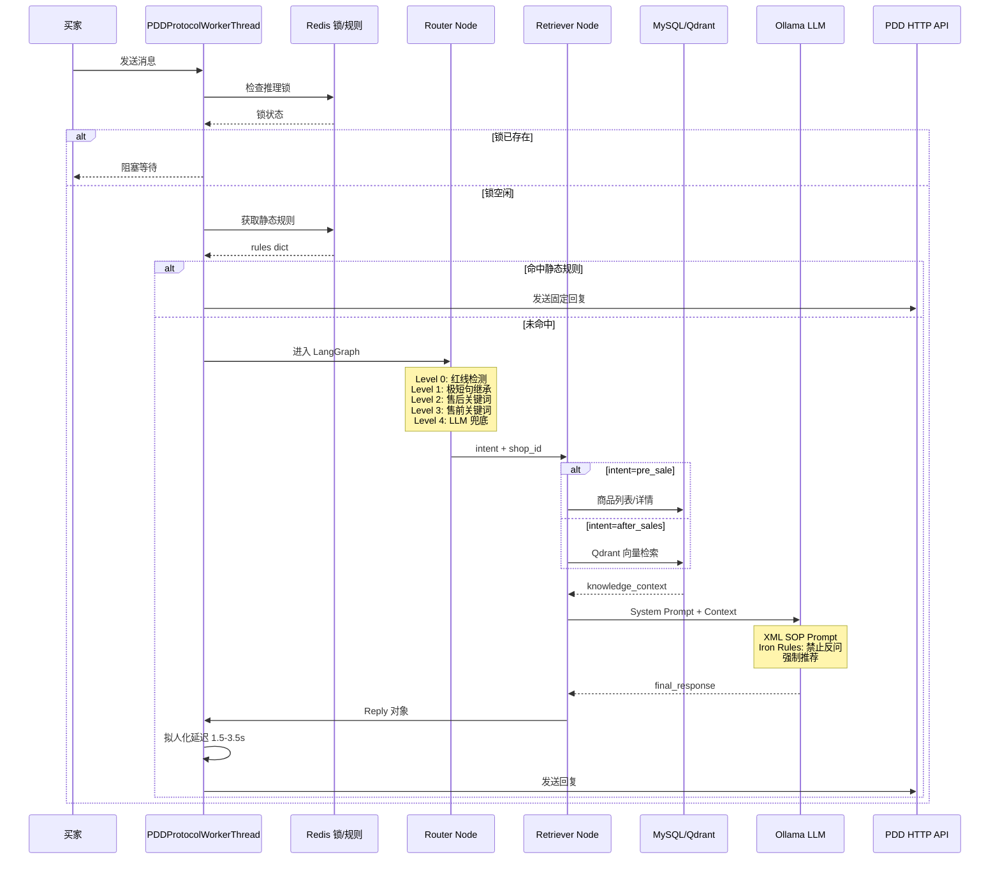

# PDD AI 智能客服引擎 V2.0 - 架构蓝图

## 系统架构总览

```mermaid
flowchart TB
    subgraph Entry["进线入口层"]
        PDD[PDDProtocolWorkerThread<br/>WebSocket 连接]
        REDIS_IN[Redis 推理锁<br/>防止重复处理]
    end
    
    subgraph L1["Level -1 静态防线"]
        STATIC[_check_static_rules<br/>Redis 静态规则匹配]
        RULES[Redis Hash<br/>shop:{shop_id}:static_rules]
    end
    
    subgraph LLMGraph["LangGraph V2.0 大脑"]
        Router[node_router<br/>五级漏斗路由]
        Retriever[node_retriever<br/>双轨知识检索]
        Generator[node_generator<br/>XML SOP 生成]
        Human[node_human_fallback<br/>转人工节点]
    end
    
    subgraph Knowledge["知识库层"]
        MySQL[ProductKnowledge<br/>MySQL 商品数据库]
        Qdrant[Qdrant 向量库<br/>售后规则知识]
        RedisIntent[Redis 意图缓存<br/>session:{id}:last_intent]
    end
    
    subgraph LLM["本地 LLM 引擎"]
        Ollama[Ollama API<br/>localhost:11434/v1]
        Qwen[customer-service:latest<br/>微调 Qwen2.5-7B]
    end
    
    subgraph Output["响应输出层"]
        HTTP_API[PDD HTTP API<br/>mms.pinduoduo.com]
        AntiBan[拟人化延迟<br/>1.5-3.5s random]
        Heartbeat[WebSocket 心跳<br/>30s interval]
    end
    
    PDD --> REDIS_IN
    REDIS_IN --> STATIC
    STATIC -->|"命中"| HTTP_API
    STATIC -->|"未命中"| Router
    
    Router -->|"pre_sale"| Retriever
    Router -->|"after_sales"| Retriever
    Router -->|"logistics"| Retriever
    Router -->|"redline"| Human
    Router -->|"unknown"| Retriever
    
    Retriever -->|"轨道A: 商品"| MySQL
    Retriever -->|"轨道B: 向量"| Qdrant
    Retriever --> Generator
    
    Generator --> Ollama
    Ollama --> Qwen
    Generator -->|"回复"| AntiBan
    AntiBan --> HTTP_API
    
    Router -.->|"缓存"| RedisIntent
    PDD -.->|"保活"| Heartbeat
```

## 数据流向详解



## 技术栈标注

| 节点 | 技术栈 | 具体实现 |
|------|--------|---------|
| **进线入口** | WebSocket | `websockets` 库，拼多多 MMS WebSocket |
| **静态防线** | Redis | `redis` 库，Hash 结构 `shop:{shop_id}:static_rules` |
| **路由节点** | Python | 五级漏斗：关键词匹配 + LLM 兜底 |
| **检索节点** | MySQL + Qdrant | `ProductKnowledge` 表 + `intent_domain` 向量库 |
| **生成节点** | Ollama | `customer-service:latest` (Qwen2.5-7B 微调) |
| **心跳机制** | WebSocket Ping | 30s interval, 3-failure circuit breaker |
| **拟人化** | Python random | `random.uniform(1.5, 3.5)` 异步延迟 |
| **参数剔除** | Pydantic | `OLLAMA_UNSUPPORTED_KEYS` 强制删除 |

## 风控参数一览

```yaml
AntiBan:
  delay_range: [1.5, 3.5]  # 秒
  distribution: uniform
  trigger: before HTTP API send
  
Heartbeat:
  interval: 30  # 秒
  timeout: 10   # 秒
  max_failures: 3  # 熔断阈值
  
IntentCache:
  ttl: 300  # 秒，Redis 意图缓存过期时间
  
HumanLock:
  ttl: 240  # 秒，人工静默锁时长
  trigger: redline 或转人工
```

## 容灾逻辑矩阵

| 场景 | 检测点 | 触发动作 | 兜底回复 |
|------|--------|---------|---------|
| **LLM 400 错误** | `Generator` | 异常捕获 | "抱歉，我现在无法回复" |
| **Redis 宕机** | `redis_manager` | 返回 True (AI 静默) | 不回复，避免抢话 |
| **Qdrant 无结果** | `Retriever` | 回退传统检索 | MySQL 全文搜索 |
| **商��列表空** | `_fetch_product_list` | 返回固定文案 | "推荐店铺热销款" |
| **WebSocket 断开** | `_heartbeat_loop` | 3 次失败熔断 | 触发重连机制 |