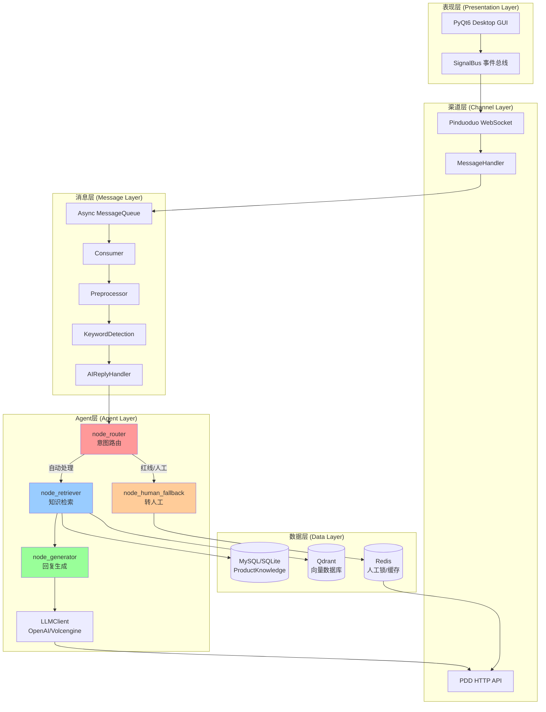
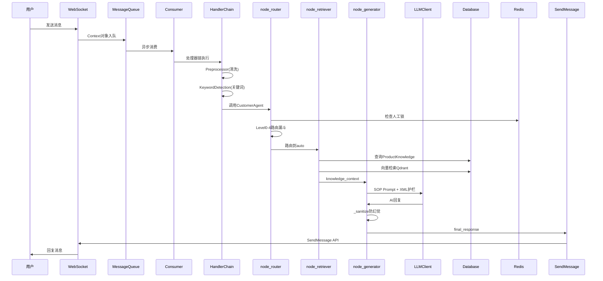

# 拼多多AI客服系统架构白皮书

> **项目代号**：customer-agent-refactor
> **版本**：V2.0（LangGraph状态机重构版）
> **定位**：电商AI客服桌面应用程序（PyQt6 GUI）

---

## 📊 执行摘要

本项目是一个工业级电商AI客服系统，采用**自研Agent框架 + LangGraph状态机**架构，实现了智能意图路由、双轨知识检索、SOP回复生成、Fail-Safe熔断保护等核心能力。系统已通过V2.0架构升级，引入LangGraph状态机、Redis人工静默锁、Qdrant向量数据库等企业级组件，具备高可用、可扩展、易维护的架构特征。

**核心价值**：
- **三级漏斗路由**：红线关键词 → 售后关键词 → 售前关键词 → LLM语义兜底
- **双轨定向检索**：售前→MySQL结构化数据，售后→Qdrant向量检索
- **XML防幻觉护栏**：针对7B本地模型优化，严苛结构化Prompt
- **Fail-Safe熔断**：Redis宕机时静默AI，防止抢话事故

---

## 🏗️ 系统架构全景图



---

## 🔀 核心业务流时序图



---

## 🎯 核心组件详解

### 1. 意图路由三级漏斗

[[CustomerAgent]] 的核心是三级漏斗路由机制，优先级绝对不可乱：

```
Level 0: 红线关键词检测（最高优先级）
Level 0.1: 主动请求人工
Level 0.5: 指代补全探测（Coreference）
Level 0.9: 明确售后表达
Level 0.95: 明确物流/闲聊/相对推荐
Level 1: 极短句意图继承
Level 2: 售后关键词检测
Level 3: 售前关键词检测（带负向词过滤）
Level 4: LLM语义兜底
```

**关键词集合**：

| 类型 | 示例 | 意图 |
|------|------|------|
| [[REDLINE_KEYWORDS]] | 投诉,举报,假货,过敏,315 | redline（强制转人工） |
| [[HUMAN_REQUEST_KEYWORDS]] | 转人工,人工客服,真人 | redline（低危转人工） |
| [[AFTER_SALES_KEYWORDS]] | 退货,换货,退款,漏液 | after_sales |
| [[PRE_SALE_KEYWORDS]] | 多少钱,价格,优惠,推荐 | pre_sale |
| [[NEGATIVE_PRE_SALE]] | 退,换,坏,破,漏 | 排除售前 |

### 2. 双轨定向检索策略

[[node_retriever]] 实现双轨定向检索：

| 检索策略 | 适用场景 | 数据源 |
|---------|---------|--------|
| CURRENT_PRODUCT | 已锁定商品属性查询 | MySQL + Qdrant向量 |
| PRODUCT_CANDIDATES | 商品推荐场景 | MySQL商品列表 + 倒排索引 |
| CLARIFY_PRODUCT | 无商品上下文 | 澄清提示模板 |
| SHOP_KNOWLEDGE | 售后政策查询 | Qdrant向量检索 |
| NONE | 通用闲聊 | 无需知识 |

### 3. LangGraph 状态机架构

[[LangGraph]] 状态机包含4个核心节点：

| 节点 | 职责 | 输入状态 | 输出状态 |
|------|------|---------|---------|
| [[node_router]] | 意图路由（三级漏斗） | user_query, session_id | current_intent, is_human_needed |
| [[node_retriever]] | 双轨知识检索 | intent, goods_id, shop_id | knowledge_context |
| [[node_generator]] | SOP回复生成 | intent, knowledge, query | final_response |
| [[node_human_fallback]] | 转人工执行 | is_human_needed=True | 安抚话术 |

### 4. XML防幻觉护栏

[[node_generator]] 使用严苛的XML结构化Prompt：

```xml
<system_role>你是某美妆香水品牌的资深售后与导购客服。</system_role>

<knowledge_base>
{knowledge}
</knowledge_base>

<iron_rules priority="highest">
1. 【只用真实SKU】必须从知识库中挑选原文存在的SKU
2. 【禁止反问】已提供商品时必须直接推荐
3. 【直接行动】买家说"推荐"时直接给出商品名+SKU
4. 【字数控制】单次回复严格控制在50字以内
</iron_rules>
```

---

## 🗄️ 数据层架构

### 关系型数据库（SQLAlchemy + SQLite）

**核心表结构**：

| 表名 | 用途 | 关键字段 |
|------|------|---------|
| [[channels]] | 渠道表 | channel_name, description |
| [[shops]] | 店铺表 | shop_id, shop_name, shop_logo |
| [[accounts]] | 账号表 | user_id, username, password, cookies |
| [[product_knowledge]] | 产品知识表 | goods_id, specifications(JSON), attribute_json |
| [[product_search_terms]] | 商品检索词倒排表 | term, term_type, weight |
| [[customer_service_knowledge]] | 客服知识表 | title, content, is_vectorized |

### 向量数据库（Qdrant）

- **Collection**: `shop_knowledge`
- **向量维度**: 384 (all-MiniLM-L6-v2)
- **距离度量**: COSINE
- **Payload索引**: `shop_id`, `intent_domain`

### 缓存架构（Redis）

| Key前缀 | 用途 | TTL |
|---------|------|-----|
| `human_lock:{user_id}` | 人工接管锁 | 240s |
| `inference_lock:{user_id}` | 推理锁 | - |
| `intent_cache:{user_id}` | 意图缓存 | INTENT_CACHE_TTL |
| `ai_awakening:{user_id}` | AI苏醒标记 | - |

---

## 🛡️ 企业级工程防线

### Fail-Safe 熔断机制

```python
# Redis 宕机时强行静默 AI
if redis_client is None:
    logger.critical(REDIS_FAILSAFE_ALERT)
    return True  # 返回 True 表示被人工接管
```

### 重试退避机制

```python
max_retries: int = 3
retry_delay: float = 1.0
retry_backoff: float = 2.0

delay = retry_delay * (retry_backoff ** attempt)
```

### 事务自动管理

```python
@contextmanager
def session_scope():
    session = self.Session()
    try:
        yield session
        session.commit()
    except SQLAlchemyError:
        session.rollback()
        raise
    finally:
        session.close()
```

---

## 📐 设计模式应用

| 模式 | 应用场景 | 实现位置 |
|------|---------|---------|
| **状态机模式** | LangGraph工作流 | CustomerAgent._build_graph() |
| **责任链模式** | 消息处理器链 | HandlerChain |
| **策略模式** | 检索策略选择 | RetrievalPolicy枚举 |
| **模板方法模式** | SOP Prompt构建 | _build_xml_sop_prompt() |
| **单例模式** | Manager类 | RedisManager, QdrantManager |
| **观察者模式** | UI事件通信 | SignalBus (PyQt Signal/Slot) |

---

## 📊 核心组件源码路径映射表

| 抽象组件 | 实现路径 | 核心类/函数 |
|---------|---------|-----------|
| **主入口** | `app.py` | `main()` |
| **依赖注入容器** | `core/di_container.py` | `DIContainer` |
| **配置管理** | `core/config_manager.py` | `ConfigManager` |
| **拼多多渠道** | `Channel/pinduoduo/pdd_channel.py` | `PDDChannel` |
| **消息队列** | `Message/core/queue.py` | `MessageQueue` |
| **消息消费者** | `Message/core/consumer.py` | `Consumer` |
| **AI回复处理器** | `Message/handlers/ai_handler.py` | `AIReplyHandler` |
| **关键词处理器** | `Message/handlers/keyword_handler.py` | `KeywordDetectionHandler` |
| **CustomerAgent** | `Agent/CustomerAgent/custom/customer_agent.py` | `CustomerAgent` |
| **LangGraph状态定义** | `Agent/CustomerAgent/custom/graph_state.py` | `CustomerServiceState` |
| **意图路由节点** | `Agent/CustomerAgent/custom/customer_agent.py:1506` | `node_router()` |
| **知识检索节点** | `Agent/CustomerAgent/custom/customer_agent.py:1960` | `node_retriever()` |
| **回复生成节点** | `Agent/CustomerAgent/custom/customer_agent.py:2118` | `node_generator()` |
| **转人工节点** | `Agent/CustomerAgent/custom/customer_agent.py:2232` | `node_human_fallback()` |
| **LLM客户端** | `Agent/CustomerAgent/custom/llm_client.py` | `LLMClient` |
| **本地LLM客户端** | `Agent/CustomerAgent/custom/local_llm_client.py` | `LocalLLMClient` |
| **会话管理器** | `Agent/CustomerAgent/custom/session_manager.py` | `SessionManager` |
| **商品列表工具** | `Agent/CustomerAgent/tools/get_product_list.py` | `get_shop_products()` |
| **商品知识工具** | `Agent/CustomerAgent/tools/get_product_knowledge.py` | `get_product_knowledge()` |
| **发送商品链接工具** | `Agent/CustomerAgent/tools/send_goods_link.py` | `send_goods_link()` |
| **客服知识检索工具** | `Agent/CustomerAgent/tools/search_customer_service_knowledge.py` | `search_customer_service_knowledge()` |
| **转人工工具** | `Agent/CustomerAgent/tools/move_conversation.py` | `transfer_conversation()` |
| **数据库管理器** | `database/db_manager.py` | `DatabaseManager` |
| **知识库服务** | `database/knowledge_service.py` | `KnowledgeService` |
| **Qdrant管理器** | `database/qdrant_manager.py` | `QdrantManager` |
| **Redis管理器** | `database/redis_manager.py` | `RedisManager` |
| **商品同步器** | `database/product_sync.py` | `ProductSyncManager` |
| **ORM模型定义** | `database/models.py` | `ProductKnowledge`, `CustomerServiceKnowledge` |
| **上下文模型** | `bridge/context.py` | `Context`, `PinduoduoKwargs` |
| **回复模型** | `bridge/reply.py` | `Reply` |
| **日志系统** | `utils/logger_loguru.py` | `get_logger()`, `BusinessLogger` |
| **信号总线** | `ui/signal_bus.py` | `SignalBus` |
| **主窗口** | `ui/main_ui.py` | `MainWindow` |

---

## 🚀 技术栈总览

| 层级 | 技术选型 | 版本 |
|------|---------|------|
| **UI框架** | PyQt6 + pyqt6-fluent-widgets | 6.9.0+ |
| **AI框架** | 自研Agent + LangGraph | 0.2.0+ |
| **LLM接入** | OpenAI API + 火山引擎Volcengine | - |
| **本地推理** | Ollama | - |
| **关系数据库** | SQLAlchemy + SQLite | 2.0.43+ |
| **向量数据库** | Qdrant | 1.7.0+ |
| **缓存** | Redis | 5.0.0+ |
| **消息通信** | WebSocket + asyncio | - |
| **中文NLP** | jieba + sentence-transformers | 0.42.1+ |
| **日志** | Loguru | 0.7.0+ |
| **配置** | Pydantic | 2.5.0+ |
| **构建工具** | uv + PyInstaller | - |

---

## 📝 架构演进历史

### V1.0（已废弃）
- 单体Agent架构
- 纯关键词路由
- 无状态管理

### V2.0（当前版本）
- ✅ LangGraph状态机架构
- ✅ 三级漏斗混合路由
- ✅ 双轨定向检索（MySQL + Qdrant）
- ✅ Redis人工静默锁
- ✅ XML防幻觉护栏
- ✅ Fail-Safe熔断保护

---

## 🎓 关键架构决策记录（ADR）

### ADR-001: 为什么选择LangGraph而非直接LLM调用？

**决策**：采用LangGraph状态机管理对话流程。

**理由**：
1. **状态可追踪**：每个节点的状态清晰可见，便于调试
2. **流程可视化**：状态流转图可自动生成，便于理解
3. **易于扩展**：新增节点只需添加节点和边，无需修改现有逻辑
4. **支持回溯**：Checkpointer机制支持状态回溯和重放

### ADR-002: 为什么采用双轨检索而非纯向量检索？

**决策**：售前问题用MySQL结构化数据，售后问题用Qdrant向量检索。

**理由**：
1. **售前场景**：商品属性、价格、规格等结构化信息，MySQL查询更精准
2. **售后场景**：售后政策、纠纷处理等非结构化文本，向量检索更灵活
3. **性能优化**：避免向量检索的召回噪音，提高精准度
4. **成本控制**：减少向量数据库的存储和计算压力

### ADR-003: 为什么需要Fail-Safe熔断机制？

**决策**：Redis宕机时静默AI，返回"被人工接管"状态。

**理由**：
1. **防止抢话**：Redis宕机时无法判断人工状态，AI继续回复会导致用户困惑
2. **安全优先**：宁可误静默，不可误抢话
3. **用户体验**：用户感知不到后端故障，只是觉得人工客服响应慢
4. **可恢复性**：Redis恢复后自动解锁，AI恢复正常

---

## 📚 参考资料

- [LangGraph官方文档](https://langchain-ai.github.io/langgraph/)
- [Qdrant向量数据库](https://qdrant.tech/)
- [PyQt6文档](https://www.riverbankcomputing.com/static/Docs/PyQt6/)
- [Loguru日志库](https://github.com/Delgan/loguru)

---

**文档生成时间**：2026-05-12 13:02 GMT+8
**文档版本**：V1.0
**生成工具**：Claude Code (Principal Engineer Agent)
