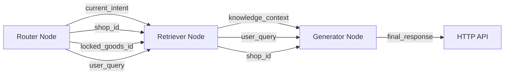

# PDD AI 智能客服引擎 V2.0 - 技术规格说明书

## 1. Prompt 字典

### 1.1 Router Node - LLM 语义兜底 Prompt

**文件位置**: `Agent/CustomerAgent/custom/customer_agent.py` 第 352-370 行

```python
def _llm_semantic_fallback(self, query: str) -> Optional[str]:
    prompt = f"""你是一个意图分类器。请将用户的这句话分类到以下三个标签之一：[pre_sale, after_sales, unknown]。
只需输出标签英文名，不要任何解释。
用户原话：{query}"""
    
    # 调用 Ollama API
    response = client.post(
        "http://localhost:11434/api/chat",
        json={
            "model": "customer-service",
            "messages": [{"role": "user", "content": prompt}],
            "stream": False,
            "options": {"num_predict": 10, "temperature": 0.1}
        }
    )
```

### 1.2 Generator Node - XML SOP Prompt

**文件位置**: `Agent/CustomerAgent/custom/customer_agent.py` 第 579-632 行

```python
def _build_xml_sop_prompt(self, intent: str, knowledge: str, 
                          goods_id: Optional[str], is_awakening: bool) -> str:
    return f"""<system_role>你是某美妆香水品牌的资深售后与导购客服。你的回复必须亲切、专业，严禁生硬和机器感。</system_role>

<session_state>
- 当前会话意图: {intent}
- 锁定的商品ID: {goods_id or "未锁定"}
</session_state>

<knowledge_base>
{knowledge}
</knowledge_base>

<iron_rules priority="highest">
1. 【禁止反问】当买家要求推荐时，立即从 <knowledge_base> 中挑选 1 款商品直接推荐，附带简短卖点（20字内）。绝对禁止向买家反问肤质、喜好、需求、预算等问题！
2. 【拒绝幻觉】如果 <knowledge_base> 提供了商品列表，必须说"有货"并推荐。绝对禁止凭空说"暂无在售"或"缺货"。如果确实没匹配到，回复"我来为您推荐本店热销款"。
3. 【直接行动】买家说"推荐"、"有什么"、"随便看看"时，你的回复第一句必须是商品名称，不要寒暄客套。
4. 【字数控制】单次回复严格控制在 50 字以内，不要长篇大论。
</iron_rules>

<instructions>
1. 绝对忠于 <knowledge_base> 提供的信息，严禁编造任何退款、赔偿、包邮承诺或香水成分。
2. 若知识库要求客户提供照片凭证（如漏液、破损），你必须在回复中温柔地引导客户发送图片。
3. 如果意图是 logistics（物流），且没有具体物流信息，请回复固定安抚话术，字数严格控制在 30 字以内。
4. 严禁暴露你是 AI，如果上文有突兀的断层，请自然接话。
</instructions>

<system_note>你刚刚从真人客服手中接管了会话，请顺着用户的最新提问自然对答，绝对不要暴露自己是AI或提及人工已离线。</system_note>"""
```

### 1.3 关键词匹配字典

**文件位置**: `Agent/CustomerAgent/custom/graph_state.py` 第 64-127 行

```python
# 售后关键词
AFTER_SALES_KEYWORDS = frozenset({
    "退货", "换货", "退款", "退", "换",
    "漏液", "破损", "坏了", "坏", "破", "漏",
    "按不出", "喷不出", "堵住", "堵了",
    "变质", "异味", "发霉",
    "没收到", "丢件", "发错", "少发", "错发",
    "签收", "快递问题",
    "降价", "差价", "补差价",
    "不喜欢", "不合适", "不满意"
})

# 售前关键词（含推荐意图）
PRE_SALE_KEYWORDS = frozenset({
    "多少钱", "价格", "优惠", "打折", "活动", "赠品",
    "会员", "折扣",
    "发什么快递", "快递", "发货", "包邮", "顺丰",
    "多久能到", "几天",
    "留香", "前调", "中调", "后调", "香调",
    "成分", "容量", "规格", "保质期",
    "适合", "孕妇", "敏感肌",
    "怎么用", "怎么喷", "喷哪里",
    # V2.0 新增：推荐意图关键词
    "推荐", "有什么", "好物", "随便", "看看",
    "哪个好", "选一个", "挑一个", "有好",
    "介绍一下", "介绍下", "想买", "想看",
})

# 售前负向关键词（出现则不是售前）
NEGATIVE_PRE_SALE = frozenset({
    "退", "换", "坏", "破", "漏", "丢", "错"
})
```

---

## 2. 上下文协议

### 2.1 CustomerServiceState TypedDict

**文件位置**: `Agent/CustomerAgent/custom/graph_state.py` 第 130-145 行

```python
class CustomerServiceState(TypedDict, total=False):
    """
    LangGraph 状态传递字典
    """
    session_id: str          # 会话唯一标识: "{channel_type}{user_id}"
    messages: List[Dict]     # 消息历史（支持累加）
    current_intent: str      # 当前意图: pre_sale/after_sales/redline/logistics/general/unknown
    locked_goods_id: str     # 锁定的商品ID（用于精准商品咨询）
    knowledge_context: str   # 知识上下文：商品详情/售后规则/商品列表
    is_human_needed: bool    # 是否需要转人工
    alert_level: str         # 警报级别: HIGH/MEDIUM/LOW/NONE
    final_response: str      # 最终回复内容
    error_message: str       # 错误信息
    shop_id: str             # 店铺ID
    from_uid: str            # 买家UID
    user_query: str          # 用户原始查询
```

### 2.2 节点间传递流程



### 2.3 Context 对象字段 (bridge/context.py)

```python
class Context:
    """消息上下文对象"""
    channel_type: ChannelType      # 渠道类型: PINDUODUO/TAOBAO
    kwargs: ContextKwargs          # 扩展参数
    
class ContextKwargs:
    shop_id: str                   # 店铺ID
    user_id: str                   # 用户ID  
    goods_id: str                  # 商品ID
    from_uid: str                  # 发送者UID
```

---

## 3. 风控参数

### 3.1 拟人化防封延迟

**文件位置**: `services/pdd_protocol_service.py` 第 532-536 行

```python
# P0 修复：拟人化防封延迟（1.5-3.5秒随机）
import random
delay = random.uniform(1.5, 3.5)
logger.debug(f"拟人化延迟: {delay:.2f}秒")
await asyncio.sleep(delay)
```

### 3.2 WebSocket 心跳机制

**文件位置**: `services/pdd_protocol_service.py` 第 574-605 行

```python
async def _heartbeat_loop(self, websocket):
    """
    心跳保活循环 - 3 次失败熔断逻辑
    """
    consecutive_failures = 0
    max_failures = 3          # 熔断阈值
    heartbeat_interval = 30   # 30秒心跳间隔
    heartbeat_timeout = 10    # 10秒超时等待
    
    while self._running:
        try:
            start_time = asyncio.get_event_loop().time()
            await asyncio.wait_for(
                websocket.ping(),
                timeout=heartbeat_timeout
            )
            response_time = asyncio.get_event_loop().time() - start_time
            
            consecutive_failures = 0  # 成功则清零
            
        except asyncio.TimeoutError:
            consecutive_failures += 1
            if consecutive_failures >= max_failures:
                logger.error("心跳连续失败 3 次，触发熔断")
                break
            await asyncio.sleep(10)  # 失败后等待 10 秒
            
        except Exception as e:
            consecutive_failures += 1
            if consecutive_failures >= max_failures:
                break
            await asyncio.sleep(10)
```

### 3.3 推理锁与意图缓存

```python
# Redis 推理锁
INFERENCE_LOCK_PREFIX = "inference_lock:{session_id}"
INFERENCE_LOCK_TTL = 60  # 秒

# 意图缓存
INTENT_CACHE_TTL = 300   # 秒
INTENT_CACHE_PREFIX = "intent:{session_id}"

# 人工静默锁
HUMAN_LOCK_TTL = 240     # 秒（4分钟）
```

---

## 4. 应答检验引擎

### 4.1 Ollama 参数剔除

**文件位置**: `Agent/CustomerAgent/custom/llm_client.py` 第 118-133 行

```python
# 构造 payload 并强制剔除 Ollama 不兼容参数
payload = validated_request.model_dump(exclude_none=True)

OLLAMA_UNSUPPORTED_KEYS = [
    "reasoning_effort",      # 思维链参数，Ollama 不支持
    "thinking",              # 同上
    "max_completion_tokens", # 含思维链的总输出长度
    "service_tier",          # 服务等级
    "stream_options",        # 流式选项
    "logprobs",              # 对数概率
    "top_logprobs",          # Top N 对数概率
    "parallel_tool_calls",   # 并行工具调用
    "tools",                 # Function Calling（Ollama 不支持）
    "tool_choice",           # 工具选择策略
]

for key in OLLAMA_UNSUPPORTED_KEYS:
    if key in payload:
        del payload[key]
        logger.debug(f"已从 payload 中剔除不兼容参数: {key}")
```

### 4.2 生成失败兜底

**文件位置**: `Agent/CustomerAgent/custom/customer_agent.py` 第 563-568 行

```python
try:
    response = await self._llm_client.chat(messages=[...])
    final_response = response.content or "抱歉，我暂时无法回复。"
except Exception as e:
    logger.error(f"[Generator] LLM 生成失败: {e}")
    final_response = "抱歉，我现在无法回复，请稍后再试。"
```

### 4.3 静态规则检查兜底

**文件位置**: `Agent/CustomerAgent/custom/customer_agent.py` 第 888-891 行

```python
except Exception as e:
    # 异常容灾：记录警告，平滑降级到 V2.0 正常路由
    logger.warning(f"[StaticRouter] 静态规则检查失败，降级到正常路由: {e}")
    return None
```

---

## 5. 容灾逻辑详解

### 5.1 Fail-Fast 机制（强制 V2.0）

**文件位置**: `Agent/CustomerAgent/custom/customer_agent.py` 第 189-197 行

```python
# 构建 LangGraph 工作流（Fail-Fast：必须成功）
if not LANGGRAPH_AVAILABLE:
    raise RuntimeError(
        "V2.0 架构加载失败！LangGraph 依赖缺失，请执行：pip install langgraph langchain langchain-core"
    )
self._graph = self._build_graph()
self._checkpointer = MemorySaver()
```

### 5.2 Redis Fail-Safe（AI 静默）

**文件位置**: `database/redis_manager.py` 第 139-155 行

```python
def is_human_locked(self, session_id: str) -> bool:
    """
    检查是否被人工接管
    
    Fail-Safe 机制：
    - 当 Redis 连接失败时，返回 True（静默 AI）
    - 宁可让 AI 误静默，不让用户困惑
    """
    if self._client is None:
        logger.warning("[FAILSAFE] Redis 未连接，AI 强制静默")
        return True
    
    try:
        key = f"{self.HUMAN_LOCK_PREFIX}:{session_id}"
        exists = self._client.exists(key)
        return exists > 0
        
    except Exception as e:
        logger.error(f"[FAILSAFE] Redis 查询失败，AI 强制静默: {e}")
        return True  # 异常时也返回 True，确保 AI 不抢话
```

### 5.3 检索降级链

```python
# Retriever Node 降级链
1. 向量检索 (Qdrant) → 有结果则返回
2. 无结果 → 回退传统 MySQL 全文检索
3. MySQL 无结果 → 返回 "未找到相关知识"
4. Generator 收到空知识 → 使用兜底 Prompt
```

---

## 6. 变量速查表

| 变量名 | 类型 | 作用域 | 说明 |
|--------|------|--------|------|
| `OLLAMA_UNSUPPORTED_KEYS` | `List[str]` | llm_client.py | 需剔除的 Ollama 参数 |
| `PRE_SALE_KEYWORDS` | `frozenset` | graph_state.py | 售前关键词集合 |
| `AFTER_SALES_KEYWORDS` | `frozenset` | graph_state.py | 售后关键词集合 |
| `NEGATIVE_PRE_SALE` | `frozenset` | graph_state.py | 售前负向关键词 |
| `REDLINE_KEYWORDS` | `frozenset` | constants.py | 红线关键词 |
| `heartbeat_interval` | `int=30` | pdd_protocol_service.py | 心跳间隔 |
| `max_failures` | `int=3` | pdd_protocol_service.py | 熔断阈值 |
| `HUMAN_LOCK_TTL` | `int=240` | constants.py | 人工锁时长 |
| `INTENT_CACHE_TTL` | `int=300` | constants.py | 意图缓存 TTL |
| `CustomerServiceState` | `TypedDict` | graph_state.py | LangGraph 状态字典 |