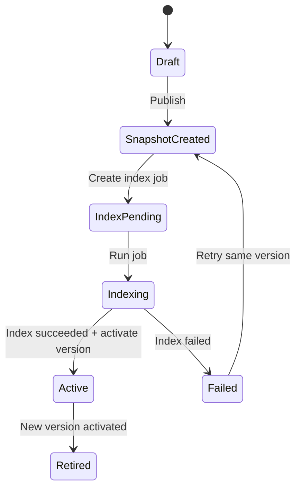

# T202 Knowledge Center Release Flow

## 1. 背景与目标

Web Admin 已经完成 InternalEngine-only 的内部运营后台骨架，并具备真实 SQLite 只读商品展示、pgvector chunks debug、RAG retrieve debug、Live Chat no-send 调试和 provider status。下一阶段需要让运营在后台维护 SOP 和商品人工知识，并通过可追踪、可回滚、可验证的发布闭环让 InternalEngine 使用这些知识。

知识不能“保存后立即生效”。RAG 知识需要经历内容快照、chunk、embedding、pgvector indexing 和 active version 切换。T202 的目标是保证三处内容一致：

1. Web Admin 后台看到的发布内容。
2. pgvector 中可检索到的 chunk。
3. InternalEngine 实际检索到的 active 知识版本。

第一阶段仍是本地内部运营后台，不是商家 SaaS；不控制真实 PDD 发送；不修改 worker/runtime；不修改现有 pipeline；不修改原始 `product_knowledge` 采集字段。Knowledge Center 只负责 SOP、商品人工增强知识、版本快照和索引任务闭环。

## 2. 核心原则

1. Draft is editable，active version is immutable。
2. Publish creates immutable snapshot。
3. Index job reads `knowledge_versions.snapshot_json` only。
4. Version becomes active only after index job succeeded。
5. Failed index does not affect current active version。
6. `product_knowledge` raw fields are never overwritten by manual overrides。
7. Manual override layer is separate and auditable。
8. pgvector indexing must be idempotent。
9. InternalEngine should eventually query active versions only。
10. No-send / no PDD sending remains unchanged。

## 3. 术语定义

- `draft`：可编辑工作区内容，例如 SOP 草稿或商品人工补充字段。保存 draft 不代表 AI 生效。
- `snapshot`：发布时从 draft 或 effective product knowledge 固定下来的不可变内容。
- `version`：一次发布产生的知识版本，保存于 `knowledge_versions`。
- `active version`：已完成索引并被标记为当前生效的版本。
- `source_type`：知识来源类型，第一阶段为 `sop` 或 `product`。
- `source_id`：来源对象 ID。SOP 使用 `sop_id`，商品使用 `goods_id`。
- `index job`：绑定某个 `version_id` 的索引任务，负责 chunk、embedding、pgvector upsert 和状态记录。
- `effective product knowledge`：`product_knowledge` 原始采集字段与 `product_manual_overrides` 人工字段合成后的商品知识视图。
- `manual override`：运营填写的商品人工增强字段，独立保存，不覆盖原始采集字段。
- `content_hash`：发布内容的稳定哈希，用于判断版本内容是否一致。
- `chunk_hash`：单个 chunk 内容的稳定哈希，用于 pgvector 幂等 upsert。
- `index_run_id`：一次索引执行的唯一 ID，用于排查、回滚、清理测试数据和定位重复写入。
- `namespace`：pgvector 逻辑命名空间，用于隔离 acceptance、production、shop/domain/version 等索引范围。

## 4. 数据模型设计

### 4.1 knowledge_sop

用途：保存 SOP 草稿和当前编辑内容。

建议字段：

- `id`
- `shop_id`
- `domain`
- `title`
- `content`
- `status`: `draft` / `archived`
- `content_hash`
- `created_by`
- `updated_by`
- `created_at`
- `updated_at`

说明：

- 这是 SOP 工作区，可以反复编辑。
- 它不代表 AI 当前使用的知识。
- 发布时读取当前内容，生成不可变 `snapshot_json`。

### 4.2 product_manual_overrides

用途：保存商品人工增强字段，不修改原始 `product_knowledge`。

建议字段：

- `id`
- `shop_id`
- `goods_id`
- `goods_name`，可冗余
- `usage_override`
- `ingredients_override`
- `warnings_override`
- `shelf_life_override`
- `manual_notes`
- `specs_override`，可选
- `price_note_override`，可选
- `status`: `draft` / `archived`
- `content_hash`
- `created_by`
- `updated_by`
- `created_at`
- `updated_at`

说明：

- 空 override 字段表示“不覆盖原始字段”。
- 第一阶段不支持显式清空原始字段。
- 后续可增加 `override_mode` 或 `field_override_mode` 支持 clear。

### 4.3 knowledge_versions

用途：保存每次发布时的不可变快照。

建议字段：

- `id`
- `shop_id`
- `source_type`: `sop` / `product`
- `source_id`: `sop_id` / `goods_id`
- `domain`
- `version`
- `content_hash`
- `snapshot_json`
- `status`: `pending_index` / `indexing` / `succeeded` / `failed` / `active` / `retired`
- `is_active`
- `index_job_id`
- `created_by`
- `created_at`
- `indexed_at`
- `activated_at`
- `retired_at`
- `error_summary`

必须约束：

- `snapshot_json` 是发布时固定下来的内容。
- 后续 draft 再修改，不影响已经生成的 snapshot。
- index job 必须读取 `snapshot_json`，不读 `knowledge_sop` 或 `product_manual_overrides`。
- `content_hash` 用于判断版本内容是否一致。

### 4.4 knowledge_index_jobs

用途：管理每次索引任务。

建议字段：

- `id`
- `shop_id`
- `version_id`
- `source_type`
- `source_id`
- `domain`
- `version`
- `status`: `pending` / `running` / `succeeded` / `failed` / `retrying` / `cancelled`
- `chunk_count`
- `embedded_count`
- `indexed_count`
- `error_summary`
- `retry_count`
- `index_run_id`
- `created_at`
- `started_at`
- `finished_at`

必须约束：

- index job 绑定 `version_id`。
- index job 执行时只读 `knowledge_versions.snapshot_json`。
- 不允许执行时重新读取 `knowledge_sop` 或 `product_manual_overrides`。
- retry 仍然索引同一个 version snapshot。

## 5. 商品 effective view 规则

商品知识合成视图：

```text
product_knowledge 原始采集字段
+
product_manual_overrides 人工字段
=
effective product knowledge
```

覆盖优先级：

1. manual override 非空字段优先。
2. manual override 空字段不覆盖原始字段。
3. 原始字段和 override 都为空，则字段缺失。
4. 第一阶段不支持“显式清空原始字段”。
5. 后续可用 `field_override_mode` 增强。

示例：

```text
effective.usage =
  override.usage_override if not empty
  else product_knowledge.usage

effective.specs =
  override.specs_override if not empty
  else product_knowledge.specs

effective.price =
  product_knowledge.price
```

价格规则：

- `price_note_override` 只作为补充说明，不直接覆盖真实价格。
- 价格最终仍以商品页面和结算页为准。
- 人工 override 不能承诺固定成交价、优惠、赠品、返差价。

## 6. 发布状态机

发布成功流：

```text
draft
  -> publish
  -> snapshot_created
  -> index_job_pending
  -> indexing
  -> index_succeeded
  -> active
```

发布失败流：

```text
draft
  -> publish
  -> snapshot_created
  -> index_job_pending
  -> indexing
  -> index_failed
  -> old_active_version_remains
```



必须强调：

- Publish 不等于 active。
- Index succeeded 才 active。
- Index failed 不影响旧 active。
- Retry 不生成新 version，除非用户重新 publish。
- 用户修改 draft 后，需要再次 publish 才生成新 version。

## 7. pgvector indexing / upsert 设计

index job 负责执行 chunk、embedding 和 pgvector upsert。第一阶段可以同步执行或由按钮手动触发；表和接口按异步 job 设计，后续迁移到 Linux worker 时不需要重构 API 和数据模型。

pgvector chunk metadata 建议包含：

- `shop_id`
- `version_id`
- `source_type`
- `source_id`
- `domain`
- `version`
- `content_hash`
- `chunk_hash`
- `index_run_id`
- `namespace`
- `is_active`
- `created_by`
- `created_at`

推荐 upsert 幂等 key：

```text
shop_id + version_id + chunk_hash
```

如果 pgvector schema 暂不支持 `version_id`，使用兼容 key：

```text
shop_id + source_type + source_id + domain + version + chunk_hash
```

约束：

- 重试同一个 index job 不应产生重复 chunk。
- 新版本 active 后，旧版本可标记 inactive，不一定立即删除。
- 支持回滚时重新激活旧版本。
- 不允许无过滤删除正式知识。
- cleanup 只用于测试数据或明确 `version_id` / `index_run_id`。

## 8. active version 规则

每个 `shop_id + source_type + source_id/domain` 可以有一个 active version。active 切换必须在 SQLite transaction 中完成：

1. 新 version 标记 `is_active=true`、`status=active`。
2. 旧 active version 标记 `is_active=false`、`status=retired` 或保留 `succeeded`。
3. 关联 index job 标记 `succeeded`。

如果 transaction 失败，不应出现两个 active。如果 index 成功但 active 切换失败，需要把 job 标记为 `retry_activate` 或 `failed` 并写入 `error_summary`，让运营或后台任务可重试。

建议 repository：

- `get_active_knowledge_version(shop_id, source_type, domain, source_id=None)`
- `list_active_versions(shop_id)`
- `activate_version(version_id)`

第一阶段 InternalEngine 可以暂不接 active version，但设计必须预留 T202-F：InternalEngine RAG 查询按 active version 过滤。

## 9. 后端 API 设计

新增 Knowledge Center API。

### SOP

| Endpoint | 目的 | 第一阶段 |
| --- | --- | --- |
| `GET /api/knowledge/sop` | 列出 SOP draft | 实现 |
| `POST /api/knowledge/sop` | 创建 SOP draft | 实现 |
| `GET /api/knowledge/sop/{id}` | 获取 SOP draft 详情 | 实现 |
| `PUT /api/knowledge/sop/{id}` | 更新 SOP draft | 实现 |
| `DELETE /api/knowledge/sop/{id}` | 归档 SOP draft | 实现，软删除 |
| `POST /api/knowledge/sop/{id}/publish` | 生成 SOP snapshot + index job | 实现 |

### Product manual overrides

| Endpoint | 目的 | 第一阶段 |
| --- | --- | --- |
| `GET /api/knowledge/products/{goods_id}/overrides` | 获取商品人工字段 | 实现 |
| `PUT /api/knowledge/products/{goods_id}/overrides` | 保存商品人工字段 | 实现 |
| `GET /api/knowledge/products/{goods_id}/effective` | 查看 effective product knowledge | 实现 |
| `POST /api/knowledge/products/{goods_id}/publish` | 发布商品 effective snapshot | 实现 |

### Versions

| Endpoint | 目的 | 第一阶段 |
| --- | --- | --- |
| `GET /api/knowledge/versions` | 列出版本 | 实现 |
| `GET /api/knowledge/versions/{id}` | 查看版本 snapshot | 实现 |
| `POST /api/knowledge/versions/{id}/activate` | 人工激活或回滚 | 保留，谨慎开放 |
| `POST /api/knowledge/versions/{id}/retire` | 下线版本 | 保留，谨慎开放 |

### Index jobs

| Endpoint | 目的 | 第一阶段 |
| --- | --- | --- |
| `GET /api/knowledge/index-jobs` | 列出索引任务 | 实现 |
| `GET /api/knowledge/index-jobs/{job_id}` | 查看索引任务详情 | 实现 |
| `POST /api/knowledge/index-jobs/{job_id}/run` | 运行 pending job | 实现 |
| `POST /api/knowledge/index-jobs/{job_id}/retry` | 重试 failed job | 实现 |

第一期建议实现 SOP CRUD + publish、product overrides GET/PUT + effective view、product publish、versions list、index jobs list/run/retry。`activate` 可以保留接口，但默认发布成功后自动 active；人工 activate/rollback 第一阶段谨慎开放。

## 10. 前端 Knowledge Center 页面

新增一级菜单：`Knowledge Center`。

包含 tabs：

- `SOP`
- `Products`
- `Versions`
- `Index Jobs`

### SOP tab

布局：

- 左侧 domain list。
- 中间 SOP list。
- 右侧 editor。

功能：

- 新建 SOP。
- 编辑 SOP。
- 保存草稿。
- 发布。
- 查看当前 active version。
- 查看最新 index job 状态。

### Products tab

布局：

- 左侧商品列表。
- 中间 raw fields + manual override editor。
- 右侧 effective preview + publish panel。

功能：

- 查看原始 `product_knowledge`。
- 编辑 manual overrides。
- 查看 effective product knowledge。
- 保存 draft override。
- 发布当前商品知识。
- 跳转 RAG Debug。
- 跳转 Live Chat no-send。

### Versions tab

展示：

- `version`
- `source_type`
- `source_id`
- `domain`
- `content_hash`
- `status`
- `is_active`
- `created_at`
- `indexed_at`
- `activated_at`
- `index_job_id`

功能：

- 查看 snapshot。
- 查看 diff，后续实现。
- activate/rollback，第一期可只读或谨慎开放。

### Index Jobs tab

展示：

- `job_id`
- `version_id`
- `source_type`
- `source_id`
- `domain`
- `status`
- `chunk_count`
- `embedded_count`
- `indexed_count`
- `retry_count`
- `error_summary`
- `started_at`
- `finished_at`

功能：

- run pending job。
- retry failed job。
- view error。
- jump to version/source。

## 11. Validation panel

每个发布成功或失败的版本都应该支持验证入口：

- Open RAG Debug。
- Open Live Chat no-send。
- View chunks。
- View `snapshot_json`。

自动带入：

- `shop_id`
- `source_type`
- `source_id`
- `domain`
- `version`
- `goods_id`，如商品。

运营发布后可以立刻验证 RAG 是否检索到新知识，也可以在 Live Chat no-send 中验证回复是否使用新知识。

## 12. 并发与一致性

SOP 和 override 保存时使用 `content_hash` / `updated_at` 做乐观并发控制。如果保存时发现内容已被别人修改，API 返回 conflict，UI 提示刷新。第一阶段可以先保留字段，后续再增加编辑锁。

发布 snapshot 时应在一个 SQLite transaction 中完成：

1. 读取当前 draft 或 effective content。
2. 生成 `content_hash`。
3. 插入 `knowledge_versions`。
4. 插入 `knowledge_index_jobs`。

index succeeded 后 active 切换也应在 transaction 中完成。

## 13. 安全与边界

Knowledge Center 不控制真实 PDD 发送，不修改 worker/runtime，不修改 pipeline，不引入 FastGPT。

普通业务知识可以展示完整内容，包括 SOP、商品人工字段、effective view、snapshot、chunk content 和 debug trace。凭证类信息仍不展示：

- API key
- token
- cookie
- authorization
- DSN password

pgvector 删除必须严格限制。第一阶段不开放无过滤 cleanup。所有 publish/index 操作必须记录操作人字段，第一期可以使用 `local_admin`。

## 14. 风险与应对

| 风险 | 应对 |
| --- | --- |
| pgvector 重复写入导致脏 chunk | 使用 upsert key / `version_id` / `chunk_hash` 幂等写入 |
| 后台显示发布成功但 RAG 查不到 | Publish 不等于 active，只有 index succeeded 后才 active |
| draft 修改影响正在索引版本 | publish 时固定 `snapshot_json`，index job 只读 snapshot |
| product raw fields 与 override 不一致 | effective view 明确字段来源和覆盖优先级 |
| active version 与 InternalEngine 查询版本不一致 | T202-F 接 active version resolver |
| 多运营并发编辑覆盖 | `content_hash` / `updated_at` 乐观锁 |
| 索引成功但 active 切换失败 | transaction + `retry_activate` / error state |
| 真实 pgvector 写失败 | index job failed，旧 active 保持 |

## 15. 实施计划

### T202-A：Schema + repository foundation

范围：

- 新增 SQLite schema/migration 或安全初始化脚本。
- 新增 `knowledge_sop`。
- 新增 `product_manual_overrides`。
- 新增 `knowledge_versions`。
- 新增 `knowledge_index_jobs`。
- 新增 repository/service。
- 不接 pgvector real write。

验收：

- CRUD repository tests。
- publish snapshot tests。
- no production impact。

### T202-B：SOP draft/publish/version/fake index

范围：

- SOP CRUD API。
- publish SOP。
- generate `snapshot_json`。
- create index job。
- fake index succeeded。
- active version。

验收：

- SOP publish 成功后 active。
- index failed 不 active。
- snapshot 不受 draft 后续修改影响。

### T202-C：Product manual overrides + effective view + publish

范围：

- override GET/PUT。
- effective product view。
- product publish。
- `snapshot_json` from effective view。
- fake index active。

验收：

- override 非空字段覆盖 raw。
- 空 override 不覆盖 raw。
- product version snapshot 不受后续 override 修改影响。

### T202-D：pgvector real index job

范围：

- chunk builder。
- Ollama embedding。
- pgvector upsert。
- `index_run_id`。
- retry。
- failed `error_summary`。

验收：

- succeeded 后 active。
- failed 不 active。
- retry 幂等。
- no duplicate chunks。

### T202-E：Knowledge Center frontend

范围：

- SOP tab。
- Products tab。
- Versions tab。
- Index Jobs tab。
- Validation panel。

验收：

- 运营可完成编辑、保存、发布、查看状态、验证。

### T202-F：InternalEngine active version integration

范围：

- active version resolver。
- RAG retriever 按 active version filter。
- Live Chat no-send 验证新版本生效。

验收：

- 发布新版本并索引成功后，InternalEngine 检索新 version。
- 旧 version 不再默认命中。
- 可回滚。

## 16. 第一阶段建议范围

推荐第一阶段先做：

- T202-A
- T202-B
- T202-C
- T202-E 基础 UI

暂缓：

- T202-D real pgvector 写入，可先 fake/dry-run。
- T202-F active version 接 InternalEngine，等发布闭环稳定后做。

这样可以先验证“草稿 -> 发布快照 -> 索引任务 -> 索引成功 -> active 生效”的业务闭环，再接真实 pgvector 写入和 InternalEngine active version filter。

## 17. 待确认问题

1. SOP 是否按 `shop_id` 独立，是否需要 global template？
2. product manual overrides 是否允许跨店铺复用？
3. version 命名规则使用自动时间戳还是运营输入？
4. 第一阶段是否允许人工 activate/rollback？
5. product price 是否允许人工补充，还是只允许备注不覆盖？
6. 是否需要审核流 draft -> approved -> publish，还是第一期直接 publish？
7. 操作人字段第一期用 `local_admin` 是否可以？
8. index job 第一阶段同步执行还是按钮手动 run？

## 18. 验收标准

文档完成后的验收输出应包含：

1. 是否修改代码：必须否，除文档外。
2. 新增/修改文档路径。
3. 设计摘要。
4. 数据表摘要。
5. 发布状态机摘要。
6. API 摘要。
7. 前端页面摘要。
8. T202-A/B/C/D/E/F 拆分。
9. 需要用户确认的问题。
10. 下一步建议。

验证要求：

- `git diff --check`
- 不运行真实 provider。
- 不连接 DB。
- 不发送 PDD。
- 不调用 FastGPT。
