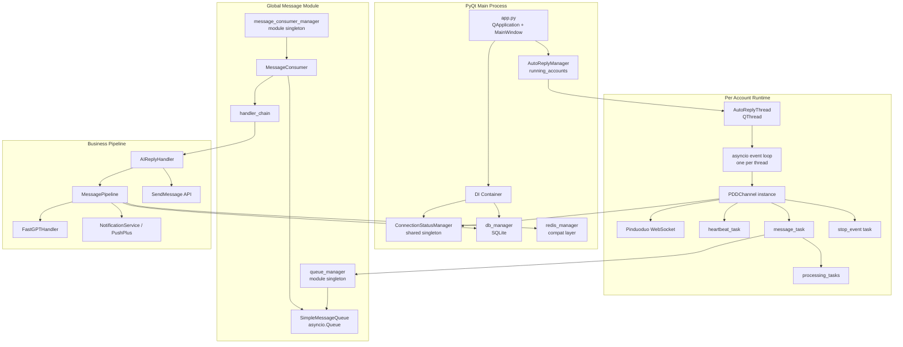

# Current Architecture Audit

## Scope

This document describes the current architecture of the Windows-local customer service assistant prototype, with emphasis on the Pinduoduo WebSocket auto-reply runtime.

Primary project inspected:

- `E:\develop\customer-agent-refactor-v3`

Related startup/API project inspected:

- `E:\develop\customer-agent-coze`

This audit is based on static code reading only. No service was started and no external API or WebSocket connection was invoked.

## High-Level Conclusion

The current business runtime is hosted inside the PyQt desktop application, not inside the FastAPI service. The Pinduoduo WebSocket listener, message queue, consumer, AI handler, FastGPT call path, and reply sending path all run in the PyQt process.

The runtime model is:

1. `app.py` starts the PyQt application and initializes shared services.
2. `AutoReplyManager` starts one `AutoReplyThread` per account.
3. Each `AutoReplyThread` creates its own `asyncio` event loop.
4. Each thread creates a `PDDChannel` instance.
5. `PDDChannel` opens a Pinduoduo WebSocket connection.
6. Incoming WebSocket messages are converted into `Context` objects.
7. Messages are put into a global-module-managed `asyncio.Queue`.
8. `MessageConsumer` invokes `handler_chain`.
9. `AIReplyHandler` invokes `MessagePipeline`.
10. `MessagePipeline` checks session state, keyword rules, FastGPT dataset configuration, and calls FastGPT.
11. Replies are sent through Pinduoduo `SendMessage`.

## Module Responsibilities

| Module | Key File | Responsibility |
|---|---|---|
| PyQt application startup | `app.py` | Initializes config, DI, DB, logger, V3 session/pipeline objects, then starts `MainWindow`. |
| Auto-reply manager | `ui/auto_reply/manager.py` | Tracks running account threads, applies start debounce, stop cooldown, and connection failure suspension. |
| Auto-reply worker thread | `ui/auto_reply/threads.py` | Creates one `QThread` per account, creates one `asyncio` loop inside that thread, starts `PDDChannel.start_account()`. |
| PDD channel facade | `Channel/pinduoduo/pdd_channel.py` | Combines connection, lifecycle, message handling, and status mixins. Holds instance state such as `self.ws`, task maps, stop events, semaphore, and resource manager. |
| Connection retry | `Channel/pinduoduo/core/pdd_connection.py` | Implements `_connect_with_retry()`, `_connect_single_attempt()`, and `_safe_close_websocket()`. |
| Connection lifecycle | `Channel/pinduoduo/core/pdd_lifecycle.py` | Implements `start_account()`, `stop_account()`, `init()`, heartbeat loop, message loop, and resource cleanup. |
| WebSocket message handling | `Channel/pinduoduo/core/pdd_message_handler.py` | Parses WebSocket payloads, detects mall customer-service messages, converts messages into `Context`, and enqueues messages. |
| Message queue | `Message/core/queue.py` | Provides `SimpleMessageQueue`, `QueueManager`, and global `queue_manager`. |
| Message consumer | `Message/core/consumer.py` | Provides `MessageConsumer`, `MessageConsumerManager`, and global `message_consumer_manager`. |
| Message module facade | `Message/__init__.py` | Exports queue/consumer helpers, `put_message()`, and `handler_chain()`. |
| AI reply handler | `Message/handlers/ai_handler.py` | Handles image interception, human lock checks, static rules, inference lock, pipeline calls, fallback, and reply sending. |
| AI pipeline | `Message/core/pipeline.py` | Handles conversation state, keyword routing, FastGPT calls, fallback, and transfer-human notification. |
| FastGPT client | `Message/handlers/fastgpt_handler.py` | Synchronous HTTP client for FastGPT `/v1/chat/completions`. |
| Session management | `Session/session_manager.py` | Manages conversations, context messages, status, fallback state, and compression. |
| Database | `database/db_manager.py` | SQLite/SQLAlchemy data access for shops, accounts, products, keywords, conversations, config, and messages. |
| Redis compatibility | `database/redis_manager.py` | Legacy Redis-style API compatibility layer; current implementation mostly delegates to SQLite config or returns safe defaults. |
| Connection status | `core/connection_status.py` | Thread-safe shared connection status store through `ConnectionStatusManager`. |
| DI container | `core/di_container.py` | Registers `ConnectionStatusManager`, `DatabaseManager`, and `NotificationService`. |
| Notifications | `core/notification.py`, `core/pushplus_notifier.py` | Human-transfer and failure notification abstraction and PushPlus integration. |
| Resource cleanup | `utils/resource_manager.py` | Tracks WebSocket objects by weak reference and provides cleanup/health helper methods. |

## Runtime Architecture

## Related Startup Components

The related project `E:\develop\customer-agent-coze` contains local Windows orchestration:

| File | Responsibility |
|---|---|
| `start_all_services.ps1` | Starts Docker/FastGPT, Ollama, proxy, FastAPI, and PyQt UI. |
| `one-click-start.bat` | Runs the PowerShell startup script. |
| `ollama_proxy.py` | Local HTTP proxy for Ollama embeddings and Doubao chat completions. |
| `projects/src/main.py` | FastAPI app exposing `/ask`, `/ask/stream`, and `/health`. |

These services are adjacent to the PyQt business runtime. The Pinduoduo WebSocket auto-reply chain is currently not hosted by `projects/src/main.py`.
