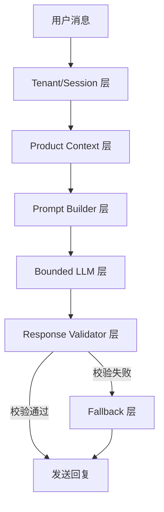
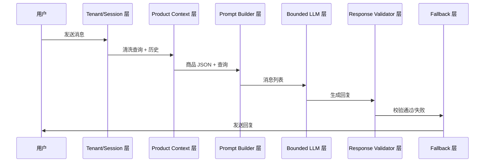
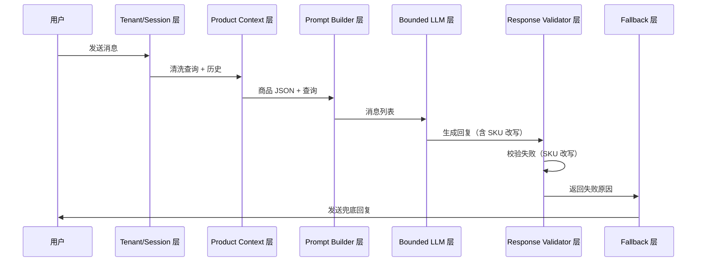

# V3.0 运行时架构

## 版本信息
- 文档版本: 1.0
- 创建日期: 2026-05-12
- 架构风格: Prompt-First 轻量架构

---

## 1. 轻量链路图

### 1.1 核心数据流



### 1.2 简化说明
相比 V2.0 的 LangGraph 状态机 + 三级路由漏斗，V3.0 链路压缩为 7 层：
1. **Tenant/Session 层**：多店铺隔离、会话历史
2. **Product Context 层**：锁定当前商品、注入单个商品 JSON
3. **Prompt Builder 层**：构造 System Prompt + 商品 JSON + 短历史
4. **Bounded LLM 层**：低温度生成（0.0-0.1）
5. **Response Validator 层**：发送前校验（SKU 改写、空字段编造、医疗承诺等）
6. **Fallback 层**：校验失败后的模板兜底或人工提示
7. **Evaluation 层**：离线回归测试（四款商品）

---

## 2. 每层职责

### 2.1 Tenant/Session 层

**职责**：
- 多店铺隔离：不同 `shop_id` 的会话互不干扰
- 会话历史管理：维护最近 N 轮对话（默认 3 轮）
- 平台识别：当前 MVP 固定为 `pdd`，但接口保留 `platform` 字段

**输入**：
- 用户原始消息
- `shop_id`、`platform`、`buyer_id`

**输出**：
- 清洗后的用户查询
- 最近 3 轮历史消息列表

**实现位置**：
- 现有代码：`Agent/CustomerAgent/custom/session_manager.py`
- 需新增：Redis key 多店铺隔离

---

### 2.2 Product Context 层

**职责**：
- 商品定位：识别当前咨询商品的 `goods_id`
  - **主来源**：平台当前咨询商品/会话锁定的 `goods_id`（由平台传入或会话记忆）
  - **兜底**：关键词匹配（从用户消息中提取商品名称关键词）或商品链接解析
- 锁定当前商品：一旦识别成功，注入该商品的结构化 JSON
- 商品记忆：记录最近推荐商品，用于"这个/那一款"追问

**输入**：
- 平台传入的 `goods_id`（主来源，如有）
- 清洗后的用户查询
- 当前会话的商品锁定状态（如有）

**输出**：
- 当前商品的 `goods_id`
- 商品结构化 JSON（包含所有非空字段）

**实现位置**：
- 现有代码：`database/product_sync.py` 的商品表查询
- 需新增：商品定位逻辑（关键词匹配作为兜底）

---

### 2.3 Prompt Builder 层

**职责**：
- 构造 System Prompt：包含角色定义、禁止行为、回复规范
- 注入商品 JSON：将当前商品的结构化字段序列化为 JSON
- 注入短历史：最近 3 轮对话历史
- Token 预算控制：总长度 <= 2048 tokens

**输入**：
- 商品结构化 JSON
- 最近 3 轮历史
- 用户当前查询

**输出**：
- 完整的消息列表（OpenAI 格式）

**实现位置**：
- 现有代码：`Agent/CustomerAgent/custom/message_builder.py`
- 需修改：Prompt 模板重构（见 [[02_prompt_contract]]）

---

### 2.4 Bounded LLM 层

**职责**：
- 低温度生成：temperature=0.0-0.1
- 调用本地模型：通过 Ollama API（http://localhost:11434）
- 限制最大 token：max_tokens=50（简洁回复）

**输入**：
- 消息列表（System + User + History）

**输出**：
- LLM 生成的回复文本

**实现位置**：
- 现有代码：`Agent/CustomerAgent/custom/local_llm_client.py`
- 需修改：温度参数调整为 0.0

---

### 2.5 Response Validator 层

**职责**：
- 发送前校验：拦截不合规回复
- 校验规则：
  - SKU 改写拦截：回复中的 SKU 必须与商品 JSON 中原文一致
  - 空字段编造拦截：商品 JSON 中空字段，回复中不允许确定回答
  - 医疗承诺拦截：不允许出现"治疗"、"治愈"等绝对承诺
  - 价格推断拦截：不允许推断价格、优惠力度
- 校验结果：通过/失败 + 失败原因

**输入**：
- LLM 生成的回复文本
- 当前商品 JSON（用于 SKU 对比）

**输出**：
- 校验结果（通过/失败）
- 失败原因（如"SKU 改写"、"空字段编造"）

**实现位置**：
- 需新增：`Agent/CustomerAgent/custom/response_validator.py`

---

### 2.6 Fallback 层

**职责**：
- 校验失败后的安全兜底
- 兜底策略：
  - 模板回复：预定义的标准化回复（如"这个信息我不确定，建议您咨询人工客服"）
  - 人工提示：提示用户联系人工客服

**输入**：
- 校验失败结果
- 失败原因

**输出**：
- 兜底回复文本

**实现位置**：
- 需新增：`Agent/CustomerAgent/custom/fallback_handler.py`

---

### 2.7 Evaluation 层

**职责**：
- 离线回归测试：四款商品的单轮/多轮查询
- 测试维度：
  - 准确率：回答是否符合商品 JSON
  - SKU 原文保持率：SKU 是否被改写
  - 空字段兜底率：空字段是否表达不确定
  - 风险安全率：医疗/价格推断是否拦截
- 指标输出：pass_rate、sku_exact_rate、empty_field_guard_rate、risk_safe_rate

**输入**：
- 测试用例 CSV（单轮/多轮）
- 商品 JSON 数据

**输出**：
- 测试报告 JSON/Markdown

**实现位置**：
- 需新增：`docs/eval/` 下的测试脚本和报告模板

---

## 3. Redis 多店铺 Key 设计

### 3.1 Key 命名规范
```
{prefix}:{shop_id}:{platform}:{buyer_id}:{suffix}
```

**参数说明**：
- `prefix`: 命名空间前缀（如 `csa` = customer service agent）
- `shop_id`: 店铺 ID（来自 MySQL `shops.id`）
- `platform`: 平台代码（当前固定为 `pdd`）
- `buyer_id`: 买家 ID（来自电商平台）
- `suffix`: 具体用途后缀

### 3.2 主要 Key 列表

| Key 模式 | 用途 | TTL | 示例 |
|---------|------|-----|------|
| `csa:{shop_id}:{platform}:{buyer_id}:session` | 会话历史（最近 N 轮） | 1800s | `csa:1:pdd:12345:session` |
| `csa:{shop_id}:{platform}:{buyer_id}:locked_goods` | 当前锁定商品 ID | 1800s | `csa:1:pdd:12345:locked_goods` |
| `csa:{shop_id}:{platform}:{buyer_id}:product_memory` | 最近推荐商品列表 | 1800s | `csa:1:pdd:12345:product_memory` |
| `csa:{shop_id}:{platform}:{buyer_id}:human_lock` | 人工请求锁定 | 300s | `csa:1:pdd:12345:human_lock` |

### 3.3 隔离保证
- 不同 `shop_id` 的会话历史互不干扰
- 不同 `buyer_id` 的会话历史互不干扰
- Key 过期时间统一由 Redis 管理（TTL）

### 3.4 实现位置
- 现有代码：`database/redis_manager.py`
- 需修改：Key 生成逻辑（当前可能缺少 `platform` 字段）

---

## 4. MySQL / Redis / Qdrant / LLM 职责边界

### 4.1 MySQL（事实源）

**职责**：
- 存储商品表（`product_knowledge`）：商品 ID、名称、价格、规格、结构化字段（`attribute_json`）
- 存储客服知识表（`customer_service_knowledge`）：售后政策、物流说明等
- 存储店铺表（`shops`）：店铺 ID、名称、账号信息

**MVP 状态**：必须

**关键表**：
- `product_knowledge`：商品事实源
- `customer_service_knowledge`：客服话术库
- `shops`：店铺信息

---

### 4.2 Redis（会话状态）

**职责**：
- 会话历史：最近 N 轮对话
- 商品锁定记忆：当前会话讨论的商品 ID
- 人工请求锁定：防止频繁转人工

**MVP 状态**：必须

**不负责**：
- 不存储商品事实（事实在 MySQL）
- 不做向量索引（Qdrant 负责）

---

### 4.3 Qdrant（向量索引）

**职责**：
- 离线评测：评估商品属性片段的检索效果
- 未来扩展：商品数量增长后做候选召回

**MVP 状态**：离线保留，不参与主链路

**理由**：
- 当前向量相似度阈值调优困难（score >= 0.55 通过率仅 7.5%）
- 四款商品 JSON 注入已足够，无需向量召回

---

### 4.4 LLM（回复生成）

**职责**：
- 生成客服回复：基于商品 JSON + Prompt
- 受 Prompt 约束：禁止编造、低温度生成

**MVP 状态**：必须

**模型**：
- 本地模型：`customer-service:latest`（qwen2 family，约 3.1B，F16）
- API：Ollama（http://localhost:11434）

---

## 5. 组件交互图

### 5.1 正常流程



### 5.2 校验失败流程



---

## 6. 文档关系
- 本文档描述运行时架构和组件职责
- [[00_v3_scope]] 定义 V3.0 范围和边界
- [[02_prompt_contract]] 定义 Prompt 合同和商品 JSON 注入格式
- [[03_response_validator_spec]] 定义回复校验器规格
