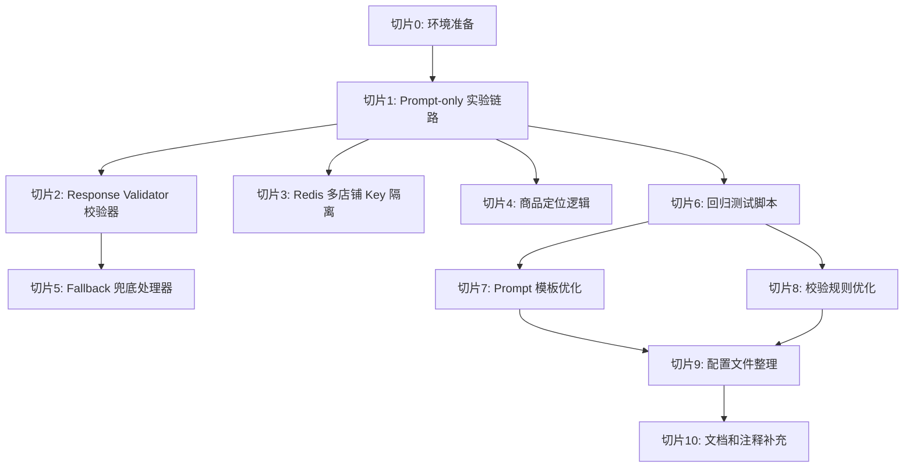

# V3.0 实现切片计划

## 版本信息
- 文档版本: 1.0
- 创建日期: 2026-05-12
- 目标：定义后续编码切片，每片小而清晰

---

## 1. 切片原则

### 1.1 切片要求

每个实现切片必须满足：
- **小而清晰**：单个切片修改文件 <= 5 个，代码行数 <= 300 行
- **可测试**：每个切片有明确的测试用例或验证方式
- **可回滚**：每个切片可独立回滚，不影响其他功能
- **不删旧逻辑**：第一片不删除 V2.0 逻辑，仅新增 Prompt-only 实验链路

---

## 2. 实现切片列表

### 切片 0：环境准备

**目标**：确保开发环境就绪

**任务清单**：
- [x] 确认 Ollama 可用，模型 `customer-service:latest` 已下载
- [x] 确认 MySQL 数据库可用，四款商品数据已同步
- [x] 确认 Redis 可用
- [x] 确认 Python 依赖已安装（PyQt6、httpx、loguru 等）

**验证方式**：
- 运行 `ollama list` 确认模型存在
- 查询数据库确认四款商品 `attribute_json` 不为空

**预期结果**：环境就绪，可开始开发

---

### 切片 1：Prompt-only 实验链路

**目标**：实现最小可行链路，验证 Prompt 合同有效性

**修改文件**：
- `Agent/CustomerAgent/custom/message_builder.py`（重构为 Prompt Builder）
- `Agent/CustomerAgent/custom/customer_agent.py`（新增实验分支）

**新增文件**：
- `Agent/CustomerAgent/custom/prompt_builder.py`（Prompt 构造器）

**代码范围**：约 200 行

**实现要点**：
1. 新增 `PromptBuilder` 类，支持商品 JSON 注入
2. 在 `customer_agent.py` 中新增实验分支（通过配置开关控制）
3. 实验分支不走 LangGraph，直接调用本地 LLM
4. 不删除 V2.0 的 LangGraph 逻辑，仅新增分支

**测试用例**：
- 输入："这个有香味吗？"
- 商品 JSON：`{"fragrance": "茉莉、栀子"}`
- 预期回复：包含"茉莉"或"栀子"

**验证方式**：
- 手动运行测试脚本（复用 `temp/no_slot_prompt_test.py`）
- 观察回复是否符合商品 JSON

**回滚方式**：
- 删除 `prompt_builder.py`
- 恢复 `customer_agent.py` 中的实验分支代码

---

### 切片 2：Response Validator 校验器

**目标**：实现回复校验器，拦截高风险回复

**修改文件**：
- `Agent/CustomerAgent/custom/customer_agent.py`（集成校验器）

**新增文件**：
- `Agent/CustomerAgent/custom/response_validator.py`（校验器实现）

**代码范围**：约 250 行

**实现要点**：
1. 实现 `validate_response` 主函数
2. 实现 5 个校验规则（SKU 改写、空字段编造、医疗承诺、价格推断、人工请求）
3. 实现 `handle_fallback` 兜底函数
4. 在实验分支中集成校验器

**测试用例**：
| 输入回复 | 商品 JSON | 预期校验结果 |
|---------|-----------|-------------|
| "有1瓶可选" | `{"sku_options": ["一瓶"]}` | 失败（SKU改写：原文"一瓶"被改写为"1瓶"） |
| "有茉莉香味" | `{"fragrance": ""}` | 失败（空字段编造） |
| "可以治疗狐臭" | - | 失败（医疗承诺） |

**验证方式**：
- 编写单元测试（`tests/test_response_validator.py`）
- 运行测试确认校验器拦截符合预期

**回滚方式**：
- 删除 `response_validator.py`
- 恢复 `customer_agent.py` 中的校验器集成代码

---

### 切片 3：Redis 多店铺 Key 隔离

**目标**：实现 Redis key 的多店铺隔离

**修改文件**：
- `database/redis_manager.py`（Key 生成逻辑）
- `Agent/CustomerAgent/custom/session_manager.py`（会话 Key 生成）

**代码范围**：约 100 行

**实现要点**：
1. 定义 Key 命名规范：`csa:{shop_id}:{platform}:{buyer_id}:{suffix}`
2. 修改所有 Redis key 生成逻辑，增加 `shop_id` 和 `platform` 字段
3. 向后兼容：如果 `platform` 未提供，默认为 `pdd`

**测试用例**：
- 输入：`shop_id=1, buyer_id=12345`
- 预期 Key：`csa:1:pdd:12345:session`

**验证方式**：
- 查询 Redis 确认 key 格式正确
- 验证不同 `shop_id` 的会话互不干扰

**回滚方式**：
- 恢复 `redis_manager.py` 中的 key 生成逻辑

**✅ 完成说明（2026-05-12）**：
- 已实现纯 Key 构建原语 `V3RedisKeyBuilder` + `TenantContext`
- 文件：`Agent/CustomerAgent/custom/v3_tenant_keys.py`
- 测试：`tests/test_v3_tenant_keys.py`（32 个测试全部通过）
- 此任务仅实现 Key 构建原语，未修改现有生产代码，未接入运行时
- 符合"不删旧逻辑、不接入运行时"的硬边界要求

---

### 切片 4：商品定位逻辑

**目标**：实现商品定位，识别当前咨询商品的 `goods_id`

**修改文件**：
- `Agent/CustomerAgent/custom/customer_agent.py`（新增商品定位函数）

**新增文件**：
- `Agent/CustomerAgent/custom/product_locator.py`（商品定位器）

**代码范围**：约 150 行

**实现要点**：
1. **主来源优先级**：
   - 优先：平台传入的当前咨询商品 `goods_id`
   - 次优：会话锁定的商品 `goods_id`（从 Redis 读取）
   - 兜底：关键词匹配（从用户消息中识别商品名称关键词）
   - 兜底：商品链接解析（从拼多多链接中提取 `goods_id`）
2. 商品记忆：记录最近推荐商品，用于"这个/那一款"追问

**测试用例**：
| 场景 | 输入 | 预期 goods_id |
|------|------|--------------|
| 平台传入商品 | `goods_id=946901558797` | `946901558797` |
| 会话锁定商品 | Redis key 存在 | 从 Redis 读取 |
| 关键词匹配（兜底） | "止汗喷雾有香味吗？" | `946901558797` |

**验证方式**：
- 编写单元测试（`tests/test_product_locator.py`）
- 手动测试商品链接解析

**回滚方式**：
- 删除 `product_locator.py`
- 恢复 `customer_agent.py` 中的商品定位调用

---

### 切片 5：Fallback 兜底处理器

**目标**：实现校验失败后的兜底回复

**修改文件**：
- `Agent/CustomerAgent/custom/response_validator.py`（已有 `handle_fallback` 函数）

**新增文件**：
- `Agent/CustomerAgent/custom/fallback_handler.py`（兜底处理器）

**代码范围**：约 80 行

**实现要点**：
1. 定义兜底模板（`template_uncertain`、`template_risk_medical` 等）
2. 实现兜底回复生成逻辑
3. 支持模板配置化（从 `config.json` 读取）

**测试用例**：
| Fallback 类型 | 预期兜底回复 |
|--------------|-------------|
| `template_uncertain` | "这个信息我不确定，建议您咨询人工客服。" |
| `template_risk_medical` | "这个商品不是药品，不能替代医疗治疗..." |

**验证方式**：
- 单元测试验证模板内容
- 集成测试验证校验失败后兜底回复

**回滚方式**：
- 删除 `fallback_handler.py`
- 恢复 `response_validator.py` 中的 `handle_fallback` 函数

---

### 切片 6：回归测试脚本

**目标**：实现自动化回归测试

**新增文件**：
- `docs/eval/v3_regression_test.py`（测试脚本）
- `docs/eval/v3_test_cases_single.csv`（单轮测试用例）
- `docs/eval/v3_test_cases_multi.csv`（多轮测试用例）

**代码范围**：约 300 行

**实现要点**：
1. 加载商品 JSON 数据
2. 加载测试用例 CSV
3. 调用 LLM API 并记录回复
4. 执行回复校验
5. 计算通过率和指标
6. 生成 JSON 和 Markdown 报告

**测试用例**：
- 输入：120 个测试用例（单轮 + 多轮）
- 预期输出：测试报告 JSON + Markdown

**验证方式**：
- 运行测试脚本，确认报告生成
- 检查指标是否符合目标

**回滚方式**：
- 删除测试脚本和测试用例文件

---

### 切片 7：Prompt 模板优化

**目标**：根据回归测试结果优化 Prompt 模板

**修改文件**：
- `Agent/CustomerAgent/custom/prompt_builder.py`

**代码范围**：约 50 行（仅修改 Prompt 文本）

**实现要点**：
1. 分析回归测试失败用例
2. 识别 Prompt 约束不足的地方
3. 调整 Prompt 文本（增加禁止行为、优化回答规则）
4. 重新运行回归测试验证改进效果

**测试用例**：
- 重新运行 120 个测试用例
- 预期：pass_rate 提升至 85%+

**验证方式**：
- 对比优化前后的测试报告

**回滚方式**：
- 恢复 Prompt 模板文本

---

### 切片 8：校验规则优化

**目标**：根据回归测试结果优化校验规则

**修改文件**：
- `Agent/CustomerAgent/custom/response_validator.py`

**代码范围**：约 100 行

**实现要点**：
1. 分析校验器误报（合规回复被拦截）
2. 调整校验规则关键词黑名单
3. 优化 SKU 原文匹配逻辑
4. 重新运行回归测试验证改进效果

**测试用例**：
- 重新运行 120 个测试用例
- 预期：误报率降低，pass_rate 提升至 85%+

**验证方式**：
- 对比优化前后的测试报告

**回滚方式**：
- 恢复校验规则代码

---

### 切片 9：配置文件整理

**目标**：整理配置文件，支持 Prompt 模板和校验规则配置化

**修改文件**：
- `config.json`

**代码范围**：约 30 行（仅修改配置）

**实现要点**：
1. 新增 `v3_prompt` 配置项（Prompt 模板）
2. 新增 `v3_validator` 配置项（校验规则关键词黑名单）
3. 新增 `v3_fallback_templates` 配置项（兜底模板）

**配置示例**：
```json
{
  "v3": {
    "enabled": true,
    "prompt": {
      "max_tokens": 50,
      "temperature": 0.0
    },
    "validator": {
      "sku_rewrite_enabled": true,
      "medical_claim_keywords": ["治疗", "治愈", "根治"]
    },
    "fallback_templates": {
      "uncertain": "这个信息我不确定，建议您咨询人工客服。",
      "risk_medical": "这个商品不是药品，不能替代医疗治疗..."
    }
  }
}
```

**验证方式**：
- 确认配置加载正确
- 确认 Prompt 模板和校验规则读取配置

**回滚方式**：
- 恢复 `config.json` 原始内容

---

### 切片 10：文档和注释补充

**目标**：补充代码注释和 README 文档

**修改文件**：
- `Agent/CustomerAgent/custom/prompt_builder.py`（补充注释）
- `Agent/CustomerAgent/custom/response_validator.py`（补充注释）
- `README.md`（补充 V3.0 说明）

**代码范围**：约 100 行（仅注释和文档）

**实现要点**：
1. 补充关键函数的 docstring
2. 补充 README 中的 V3.0 架构说明
3. 补充使用示例和配置说明

**验证方式**：
- 代码审查确认注释完整
- 确认 README 文档清晰

**回滚方式**：
- 恢复原始注释和文档

---

## 3. 切片依赖关系



---

## 4. 实施时间线（估算）

| 切片 | 预计时间 | 累计时间 |
|------|---------|----------|
| 切片 0：环境准备 | 0.5 天 | 0.5 天 |
| 切片 1：Prompt-only 实验链路 | 2 天 | 2.5 天 |
| 切片 2：Response Validator 校验器 | 1.5 天 | 4 天 |
| 切片 3：Redis 多店铺 Key 隔离 | 0.5 天 | 4.5 天 |
| 切片 4：商品定位逻辑 | 1 天 | 5.5 天 |
| 切片 5：Fallback 兜底处理器 | 0.5 天 | 6 天 |
| 切片 6：回归测试脚本 | 1 天 | 7 天 |
| 切片 7：Prompt 模板优化 | 1 天 | 8 天 |
| 切片 8：校验规则优化 | 0.5 天 | 8.5 天 |
| 切片 9：配置文件整理 | 0.5 天 | 9 天 |
| 切片 10：文档和注释补充 | 1 天 | 10 天 |

**总计**：约 10 个工作日（2 周）

---

## 5. 风险与应对

### 5.1 Prompt 约束不足

**风险**：Prompt 合同无法有效约束 LLM，导致编造或改写

**应对**：
- 切片 7 迭代优化 Prompt 模板
- 增加校验器拦截（切片 2、8）

---

### 5.2 校验器误报

**风险**：校验器误报导致合规回复被拦截

**应对**：
- 切片 8 优化校验规则
- 增加白名单机制（如否定表达不算医疗承诺）

---

### 5.3 商品定位不准确

**风险**：关键词匹配误识别 `goods_id`

**应对**：
- 切片 4 增加商品名称相似度评分
- 支持多候选商品，让用户选择

---

### 5.4 回归测试未达标

**风险**：回归测试 pass_rate < 80%

**应对**：
- 分析失败用例，识别根本原因
- 迭代优化 Prompt 模板（切片 7）和校验规则（切片 8）

---

## 6. 完成标准

### 6.1 切片完成标准

每个切片完成的标志：
- 代码已提交到 Git 分支
- 单元测试通过（如有）
- 集成测试通过（如有）
- 代码审查通过

---

### 6.2 V3.0 整体完成标准

- 所有切片完成
- 回归测试 pass_rate >= 80%（单轮）
- 回归测试 pass_rate >= 75%（多轮）
- SKU 原文保持率 >= 95%
- 空字段兜底率 = 100%
- 风险安全率 = 100%

---

## 7. 文档关系
- 本文档定义实现切片计划
- [[00_v3_scope]] 定义 V3.0 范围和成功标准
- [[01_runtime_architecture]] 描述运行时架构（切片实现目标）
- [[02_prompt_contract]] 定义 Prompt 合同（切片 1、7 的依据）
- [[03_response_validator_spec]] 定义校验器规格（切片 2、8 的依据）
- [[04_eval_plan]] 定义回归测试计划（切片 6 的依据）
